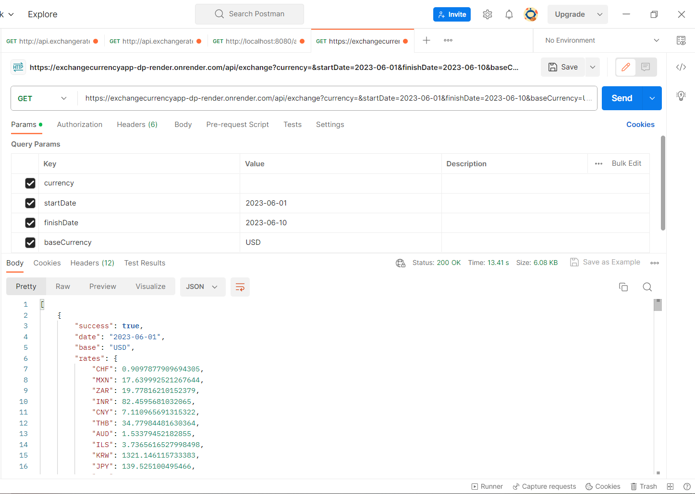

# Content of Project
* [General info](#general-info)
* [Technologies](#technologies)
* [More detailed information about application](#more-detailed-information-about-application)
* [Application view](#application-view)
* [Todo](#todo)
## General info
A currency exchange application developed with a CI/CD workflow, providing REST API endpoints that return selected exchange rates in JSON format. The application automatically builds and deploys with every push to the repository using Render. Docker containers are used for the deployment process.

## Technologies

Java 17, Spring 3.1.0, Spring Boot, PostgreSQL 15, Maven, Docker, GitHub, JUnit, Render, Jackson.

## More detailed information about application

The application and its database PostgreSQL is hosted on Render.com. Database stores over 30 different currency types and their exchange rates, first entry is from 1999-01-04. Every four hours application performs automatic REST API request to exchangeratesapi.io in search of new exchange rates. If received exchanges are new, the data is inserted to the database. 

All sensitive data like database connection credentials are stored in local machine's environment variables for development and Render's web service secrets for deployment.

URL of the application: https://exchangecurrencyapp-dp-render.onrender.com

The user can access those rates by sending request to /api/exchange endpoint.
Available optional URL parameters:
 - currency - exchange rates of chosen currency type
 - baseCurrency - changing the base currency(default is EUR)
 - startDate - return exchanges starting from the chosen date
 - finishDate - return exchanges finishing at the chosen date

Not providing values to these parameters will result in receiving the latest exchange date from all the currencies and Euro as the base.
## Application view

Application UI is on TODO list.

## Todo

- Authorization and authentication
- UI graphic interface - another application developed with Angular. Sends REST API requests to this application, receives data and displays exchange ratios graphs and statistics.
